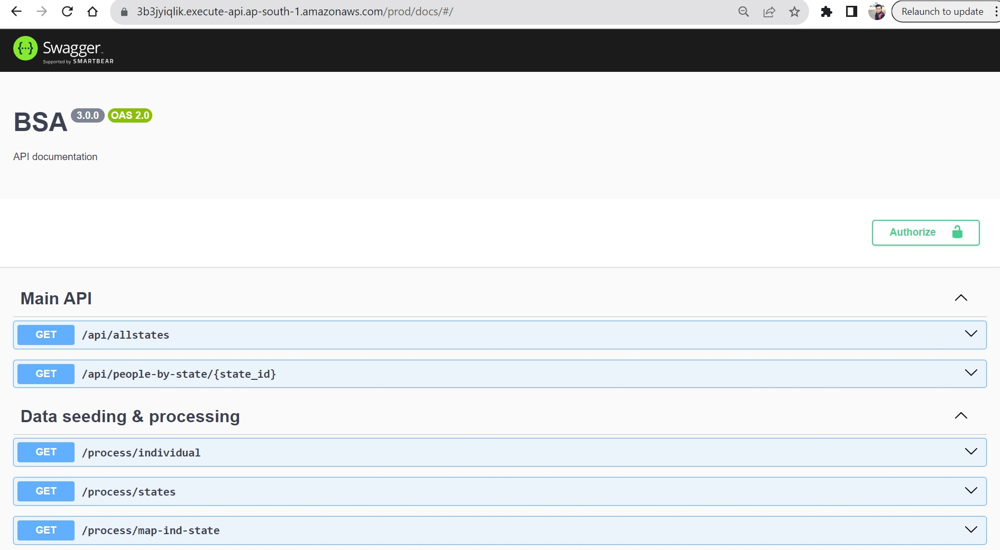
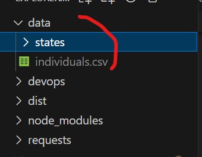
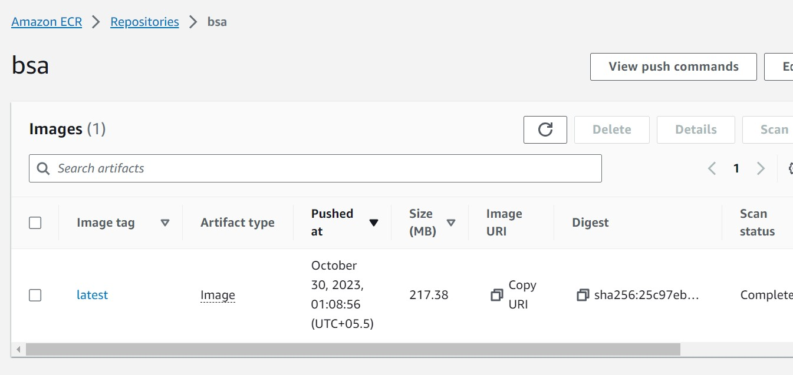

# Project details

## Languages used

- ES6
- nodejs
- typescript
- express
- typeorm
- postgresql (AWS RDS)
- postgis
- cloud formation
- docker
- shell scripting
- AWS lambda & api gateway

## How to run

- git clone
- run `npm install`
- run `cloudformation_db.yaml` to create an postgre rds in AWS
- copy the rds endpoint url
- check the `.env` file _(.env.sample is included)_
- place the database url in `.env` file
- run `npm run dev` _(this will create database and tables)_
- open `devops` folder and run `sql_scripts.sql` _(this will create a procedure which maps person to state)_
- you can access the api at http://localhost:3002
- swagger url at http://localhost:3002/docs

## Data seeding & mapping

- check the image below
- create a `data` folder and place `individual.csv`
- create a `states` folder and place geojson files for all states inside the `states` folder
- open the swagger url http://localhost:3002/docs
- go to `Data seeding & processing` section
- execute `/process/individual` api to process `individual.csv`
- execute `/process/states` api to process all `{state_name}.geojson` files
- execute `/process/map-ind-state` api to map individual to state

## Run API

- execute `/api/allstates` to get all states
- execute `/api/people-by-state/{state_id}` to fetch all people by state id

## Build

- docker image is uploaded to AWS ECR
- create an ECR repo
- open `script.sh` and update line 22,23,24 with ECR repo details
- run `script.sh` _(this will build the project, build image and upload to AWS ECR)_

## Deployment

- run `cloudformation_lambda.yaml` by passing required parameter
- copy the api gateway url from `output` tab and run in browser
